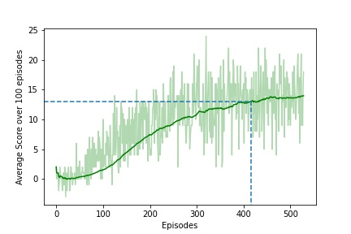

# Navigation DQN

## Deep Q-Network (DQN) Reinforcement Learning using PyTorch and Unity ML-Agents

A  simple project to show how to implement vector based DQN using Python, PyTorch, and a ML-Agents environment. This project has been done as a part of Udacity Nanodegree in Deep Reinforcement Learning (DRL)

## Project Structure:
```
├───.ipynb_checkpoints
├───images
├───python
│   ├───communicator_objects
│   ├───curricula
│   ├───tests
│   ├───unityagents
│   └───unitytrainers
│       ├───bc
│       └───ppo
│ Banana_Windows_x86_64.zip
│ dqn_agent.py
│ model.py
│ Navigation.ipynb
│ README.md
│ replay_buffer.py
│ Report.pdf
│ test_agent.py
│ train_agent.py
│ unity-environment.log
├───saved_models
├───scores
└───__pycache__
```

Important files and folders :
- 
- `dqn_agent.py:` Contains the source code of DQN agent implementation.
- `replay_buffer.py:` Replay buffer implementaion for the dqn-agent to learn the best actions.
- `model.py:` Contains the Deep Neural Network implementation (PyTorch) for vector based DQN learning.
- `train_agent.py:`Initializes and implements the training process for the DQN agent.
- `test_agent.py:` Tests the the above trained DQN agent.
- `saved_models:` Folder that contains the weigts of trained DQN (.pth format)
- `scores:` Folder that contains the scores/rewards earned by the DQN agent (.csv format)
- `python:` The files in this directory are the ML-agents toolkit files and the dependencies thare are required to run the Banana Environment.

Code has been extracted from the code examples provided by Udacity Deep Reinforcement Learning Team, 2021.

The repository also includes Mac/Linux/Windows version of a sample Unity environment, Banana for testing. The Unity application and testing environment was developed using ML-agents Beta v0.4. The version of the Banana environemnt employed for this project was developed for the Udacity Deep Reinforcement Learning Nanodegree course. For more information please refer to the following link:  [Udacity Deep Reinforcement Learning](https://www.udacity.com/courses/deep-reinforcement-learning-nanodegree--nd893)

 For more information about the Unity ML Agents Toolkit visit:  [Unity ML Toolkit](https://github.com/Unity-Technologies/ml-agents)


## Unity Environment - Banana 

The example uses a modified version of the Unity ML-Agents Banana Collection example Environment. The environment includes a single agent, who can turn left or right or move forward or more backward. The agent's task is to collect yellow bananas (which yeild a reward of +1) that are scatters around in a compound, while avoiding picking up purple bananas (this penalises the agents by rewarding -1). For the version of Bananas employed here, it is considered that the agent has solved the environment when the average score over the last 100 episodes >= 14.


 Action Space
 -
At each time step, the agent can perform one of the 4 possible actions.

```
- 0: walk forward
- 1: walk backward
- 2: turn left
- 3: turn right
```

State Space
-
The agent is trained from vector input data (not the raw pixels as input data). The state space is of `37` dimensional data and contains:


Reward:
-
A reward of +1 is provided for collecting a yellow banana, and a reward of -1 is provided for collecting a purple banana.

Installation and getting started with:

## Set up the Environment (adapted from Udacity DRL [GitHub Repo](https://github.com/udacity/deep-reinforcement-learning) )

To set up your python environment to run the code in this repository, follow the instructions below.

1. Create (and activate) a new environment with Python 3.6.

    - __Linux__ or __Mac__: 
    ```bash
    conda create --name drlnd python=3.6
    source activate drlnd
    ```
    - __Windows__: 
    ```bash
    conda create --name drlnd python=3.6 
    activate drlnd
    ```
    
2. Follow the instructions in [this repository](https://github.com/openai/gym) to perform a minimal install of OpenAI gym.  
    - Next, install the **classic control** environment group by following the instructions [here](https://github.com/openai/gym#classic-control).
    - Then, install the **box2d** environment group by following the instructions [here](https://github.com/openai/gym#box2d).
    
3. Clone the repository (if you haven't already!), and navigate to the `python/` folder.  Then, install several dependencies.
```bash
git clone https://github.com/Rohithmarktricks/Navigation_DQN.git
cd Navigation_DQN/python
(drlnd) C:/../Navigation_DQN/python >pip install .
```
 - For __Windows 10__: This project has been developed with python v3.6 and PyTorch v0.4.0. You might see the `pytorch==0.4.0`. Incase, if you have faced any issues related to PyTorch related to pytorch installation. Follow the below steps, before proceeding to step 5
 - remove `pytorch==0.4.0` from python/requirements.txt and from command prompt,
 ```bash
(drlnd) C:/../Navigation_DQN >conda install pytorch=0.4.0 -c pytorch
(drlnd) C:/../Navigation_DQN > cd python
(drlnd) C:/../Navigation_DQN/python > pip install .
```


4. Create an [IPython kernel](http://ipython.readthedocs.io/en/stable/install/kernel_install.html) for the `drlnd` environment.  
```bash
(drlnd) C:/../Navigation_DQN >python -m ipykernel install --user --name drlnd --display-name "drlnd"
```

5. Before running code in a notebook, change the kernel to match the `drlnd` environment by using the drop-down `Kernel` menu. 


## Download the Unity Environment:
For this project, you don't need to install Unity. For the sake of easiness, a standalone application of the Banana's Unity Environment has already been built and can be used.

Download the relevant environment zip file from one of the links below based on the operating system that you ar using.

- Linux: [click here](https://s3-us-west-1.amazonaws.com/udacity-drlnd/P1/Banana/Banana_Linux.zip)
- Mac OSX: [click here](https://s3-us-west-1.amazonaws.com/udacity-drlnd/P1/Banana/Banana.app.zip)
- Windows (32-bit): [click here](https://s3-us-west-1.amazonaws.com/udacity-drlnd/P1/Banana/Banana_Windows_x86.zip)
- Windows (64-bit): [click here](https://s3-us-west-1.amazonaws.com/udacity-drlnd/P1/Banana/Banana_Windows_x86_64.zip)

After you have downloaded the relevant zip file, navigate to where you downloaded and saved this GitHub repository and place the file in the main folder of the repository, then unzip (or decompress) the file.

NOTE: The Banana environment is similar to, but not identical to the Banana Collector environment on the Unity ML-Agents GitHub page.

## Training 
6. In the `Navigation_DQN` folder, you may chose one of the below methods to run train the agent.
- You may chose to open `Navigation.ipynb` jupyter notebook to experiment with the environment and tune agent performance.
- Else, you can try running the below commands in the terminal to train/test agent in the Banana Environment:
```bash
conda activate drlnd
cd Navigation_DQN
Navigation_DQN >python train_agent.py Banana_Windows_x86_64/Banana.exe DQN
```


## Testing
7. To test the trained agent, you may use the following command:
```bash
conda activate drlnd
cd Navigation_DQN
Navigation_DQN >python test_agent.py Banana_Windows_x86_64/Banana.exe <path to saved models weights .pth file> DQN
```

## Training Performance
The agent has been trained over 15 times, and on average the agent has taken around 430+ episodes to solve the Unity ML Banana Environment i.e., to score the atleast +13 average reward over 100 episodes. However, the least number of episodes required to solve the environment was 400 episodes).



## Sample Testing (Jupyter Notebook)
To test the Unity ML environment and the agent, Jupyter Notebook `Navigation.ipynb` has been provided. You can quickly change the code/ tweak few hyperparameters to get started.

## Future Work:
- Duelling DQN can be explored to check if agents performance can be improved.
- At the same time, the existing DQN, Double DQN can be used to train on the pixel-based data (raw images as states/inputs to the deep(covolutional) neural network. 

## References:
1. https://pytorch.org/tutorials/intermediate/reinforcement_q_learning.html
2. https://unnatsingh.medium.com/deep-q-network-with-pytorch-d1ca6f40bfda
3. https://ai.googleblog.com/2015/02/from-pixels-to-actions-human-level.html
4. Ravichandiran, Sudharsan. Deep Reinforcement Learning with Python: Master classic RL, deep RL, distributional RL, inverse RL, and more with OpenAI Gym and TensorFlow, 2nd Edition. Packt Publishing.
